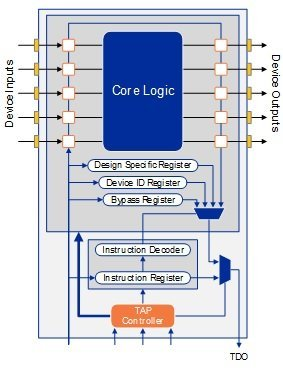

<!---

This file is used to generate your project datasheet. Please fill in the information below and delete any unused
sections.

You can also include images in this folder and reference them in the markdown. Each image must be less than
512 kb in size, and the combined size of all images must be less than 1 MB.
-->

## How it works

There are two major components within this design: a RISC-V processor and reusable JTAG-Compliant Test Logic. The goal of the JTAG test logic is to directly test an integrated circuit by adjusting input data and capturing values on important registers of a design during a single clock cycle. This way, we can detect the exact moment we see an error and on which register it occurs. For this demo, the RISC-V processor is the Device Under Test. 

In order to test the processor, boundary-scan registers are placed in parallel with each register that we want to test. With the input data high, we wait until the processor has wrote to memory, check the register values, and then return either success or fail based on expected values. Below is a high-level look at the JTAG design. In this case, the RISC-V processor is the Core Logic.

## How to test

Test results are indicated by the success/fail outputs of the design. Test conditions are set through HDL. Once input values are set, a result will be seen on the output. For this demo, the RISC-V processor is intentionally broken. Thus, a fail will be seen on the output. 

